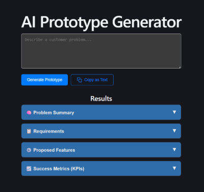

# AI Customer Prototype Generator

[](https://semver.org)

## Project Overview

> A powerful full-stack application that transforms messy customer interview inputs—notes, transcripts, or problem descriptions—into structured problem summaries, product requirements, proposed features, and success metrics.

Built to demonstrate rapid concept validation workflows.



---

## Tech Stack

| Category | Technology              |
| :------- | :---------------------- |
| Backend  | Python, FastAPI         |
| Frontend | React/Next.js dashboard |
| LLM Core | Gemini AI API           |

### API Endpoints

- `POST /analyze` — Processes raw interview text and returns the structured prototype blueprint.

---

## Getting Started

### Prerequisites
Make sure you have the following installed on your machine:

- **[Node.js](https://nodejs.org)** (v18 or higher recommended)
- **[Python](https://python.org)** (v3.10 or higher recommended)
- A **[Gemini API Key](https://google.com)**

---

## Installation and Setup

Clone this repository and follow these steps to get your environment running locally.

### 1. Backend Setup (`FastAPI`)

Navigate to the backend directory:

```bash
cd backend
```

> (Note: Adjust this path if your main.py is in a different folder).

Create and activate a virtual environment:

**Windows:**

```bash
python -m venv venv
venv\Scripts\activate
```

**macOS/Linux:**

```bash
python3 -m venv venv
source venv/bin/activate
```

Install the required dependencies:

```bash
pip install fastapi uvicorn google-genai pydantic python-dotenv
```

Configure your Environment Variables:
Create a `.env` file in the root of your `backend` directory and add only your Gemini API key:

```bash
GEMINI_API_KEY=your_actual_api_key_here
```

Start the FastAPI server:

```bash
uvicorn main:app --reload
```

The backend should now be running at `http://127.0.0.1:8000`.
You can verify it by visiting http://127.0.0.1:8000/ in your browser.

---

## 2. Frontend Setup (`React + Vite`)

Open a new terminal window and navigate to the frontend directory:

```bash
cd frontend
```

Install the dependencies:

```bash
npm install
```

Start the Vite development server:

```bash
npm run dev
```

Open the application:
The terminal will provide a local URL (typically http://localhost:5173). Open this link in your browser to start generating product prototypes!

## Contributing and Community

Whether you want to fix a bug, propose a new UI layout, or add a pre-configured persona template, your contributions are incredibly welcome!

1. **Fork** the Project (▶️ Fork)

2. **Create** your Feature Branch (`git checkout -b feature/NewFeature`)

3. **Commit** your Changes (`git commit -m 'Add some NewFeature`)

4. **Push** to the Branch (`git push origin feature/NewFeature`)

5. **Open** a Pull Request

Have ideas on how to make this tool better for developers? Open an issue or reach out to me directly on [LinkedIn](https://www.linkedin.com/in/akendr/).
